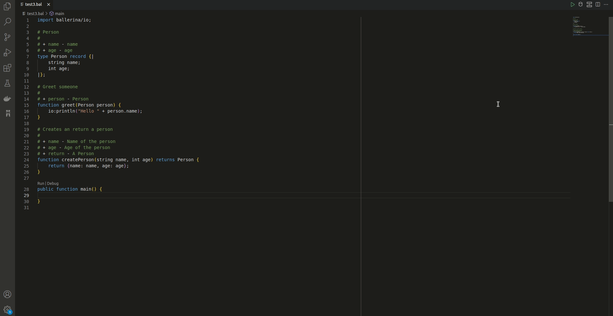

# The Ballerina extension for Visual Studio Code

The Ballerina extension for Visual Studio Code provides a set of rich language features along with an enhanced user experience. 

It offers easy development, execution, debugging, and testing for the [Ballerina programming language](https://ballerina.io/). The Ballerina language possesses a bidirectional mapping between its syntaxes and the visual representation. You can visualize the graphical representation of your Ballerina source further via the extension.

## Quick start

Follow the steps below to get the Ballerina VS Code extension up and running.

1. [Install the extension](https://wso2.com/ballerina/vscode/docs/get-started/install-the-extension/).
2. [Run a program](https://wso2.com/ballerina/vscode/docs/get-started/run-a-program/).

## Features

The main functionalities of the extension are listed below.

### Code editing

Use the following features of this extension to edit Ballerina code via the VS Code extension.

- [IntelliSense](https://wso2.com/ballerina/vscode/docs/edit-the-code/intellisense/)
- [Code navigation](https://wso2.com/ballerina/vscode/docs/edit-the-code/code-navigation/)
- [Code actions](https://wso2.com/ballerina/vscode/docs/edit-the-code/code-actions/)
- [Diagnostics](https://wso2.com/ballerina/vscode/docs/edit-the-code/diagnostics/)
- [Commands](https://wso2.com/ballerina/vscode/docs/edit-the-code/commands/)

### Visual programming

The VS Code extension allows you to visualize a program written in Ballerina as a graphical representation of the code. This graphical view displays the logic and network interaction of a function or a service resource, which makes it easy to understand the source. 

- [Sequence Diagram](https://wso2.com/ballerina/vscode/docs/visual-programming/sequence-diagram-view/)
- [Architecture Diagram](https://wso2.com/ballerina/vscode/docs/visual-programming/architecture-view/architecture-diagram/)
- [Data Mapper](https://wso2.com/ballerina/vscode/docs/visual-programming/data-mapper/)
- [HTTP API Designer](https://wso2.com/ballerina/vscode/docs/visual-programming/http-api-designer/)
- [GraphQL API Designer](https://wso2.com/ballerina/vscode/docs/visual-programming/graphql-api-designer/)
- [Type Diagram](https://wso2.com/ballerina/vscode/docs/visual-programming/architecture-view/type-diagram/)

### Debugging capabilities

Use the following features to debug your Ballerina programs via the VS Code extension.

- [Debug using CodeLens](https://wso2.com/ballerina/vscode/docs/debug-the-code/#debug-using-codelens)
- [Debug using configurations](https://wso2.com/ballerina/vscode/docs/debug-the-code/#debug-using-configurations)
- [Set up debugging configurations](https://wso2.com/ballerina/vscode/docs/debug-the-code/#set-up-debugging-configurations)
- [Use the debugging features](https://wso2.com/ballerina/vscode/docs/debug-the-code/#use-the-debugging-features)

### Notebooks

Use the following features to work with Ballerina notebooks via the VS Code extension.

- [Create a notebook](https://wso2.com/ballerina/vscode/docs/notebooks/#create-a-notebook)
- [Execute the code](https://wso2.com/ballerina/vscode/docs/notebooks/#execute-the-code)
- [Edit the code](https://wso2.com/ballerina/vscode/docs/notebooks/#edit-the-code)
- [View variables](https://wso2.com/ballerina/vscode/docs/notebooks/#view-variables)
- [Debug notebooks](https://wso2.com/ballerina/vscode/docs/notebooks/#debug-notebooks)

## Configure the extension

You can configure the Ballerina VS Code extension to get a custom user experience. For more details, see [Configure the extension](https://wso2.com/ballerina/vscode/docs/configure-the-extension/).

## Troubleshoot

For troubleshooting, see the Ballerina output. To view the Ballerina output tab, click **View**, click **Output,** and select **Ballerina** from the output list. It provides additional information if the plugin fails to detect a Ballerina distribution.  

You can also enable the [debug logs](https://wso2.com/ballerina/vscode/docs/configure-the-extension/#advanced-configurations) from the Ballerina extension settings to view any issues arising from the extension features.

## Documentation

The [Ballerina VS Code Extension Documentation](https://wso2.com/ballerina/vscode/docs/) describes the functionalities of this extension in detail.
