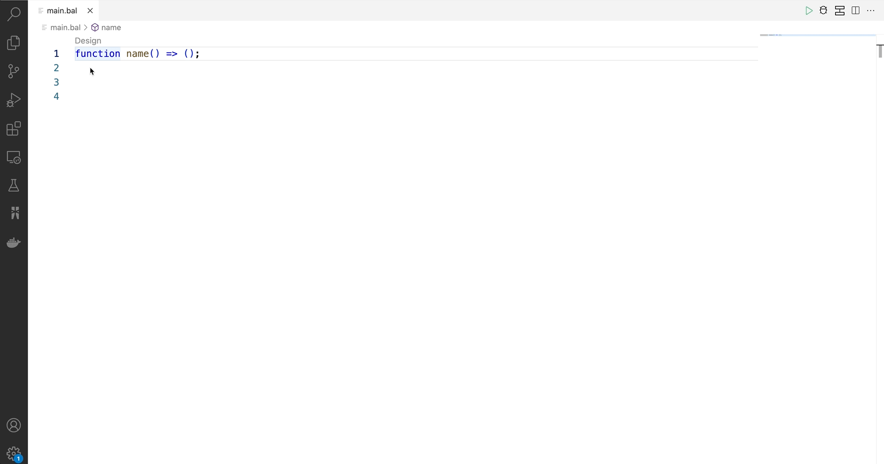

# Data Transformation with Ballerina

Data transformation is the process of converting data from one format or structure into another. If you are writing enterprise applications or doing data integrations it is most likely that a significant part of the code you write relates to data transformations. 

Ballerina is a multi paradigm language. With Ballerina you can write the data transformation logic in an imperative manner. But Ballerina comes with a special set of language features that will help you to write the transformation logic declaratively. By writing transformation logic declaratively you can make the code more readable and maintainable. On top of that Ballerina VSCode plugin comes with a data mapping tool which will help you to view and implement these transformations graphically.

## Example

Let's take the following example where you have to transform the Person and a list of courses to a student record. At start you would have the following data in json format.

**Input**
```json
{
    "person": {
        "id": 1001,
        "firstName": "Vinnie",
        "lastName": "Hickman",
        "age": 15
    },
    "course": [
        {
            "id": "CS6002",
            "name": "Computation Structures",
            "credits": 4
        },
        {
            "id": "CS6003",
            "name": "Circuits and Electronics",
            "credits": 3
        },
        {
            "id": "CS6004",
            "name": "Signals and Systems",
            "credits": 3
        }
    ]
}
```

**Output - Student**
```json
{
    "id": 1001,
    "fullName": "Vinnie Hickman",
    "age": "15",
    "courses": [
        {"title": "CS6002 - Computation Structures", "credits": 4},
        {"title": "CS6003 - Circuits and Electronics", "credits": 3},
        {"title": "CS6004 - Signals and Systems", "credits": 3}
    ]
}

```

Before we start make sure you have installed latest [Ballerina version ( 2201.2.1+)](https://ballerina.io/downloads/) and latest [Ballerina VSCode plugin](https://marketplace.visualstudio.com/items?itemName=wso2.ballerina)

Create a package if you are not already working on one. Following command will create a package called convert.

`bal new convert`

Open package with VSCode.

## Writing data transformation function

In Ballerina the preferred way to model the transformation logic is via expression bodied functions. Let's start with defining an empty expression bodied function

```ballerina
function name() => ();
```

Above we have defined an expression bodied function which will simply return nil. Here the function body is an expression which will return a nil value.

Once you add the above function the VSCode plugin will display a code lens called `Design`  on top of the function. Click the design code lens to go to the Data mapper view.



Once the data mapper is opened it will prompt you to provide input and output of the transformation function. The input and output can be any data type in Ballerina. In the example we are converting json to json hence we can use Ballerina record types as input and output. 

In data mapper form you have several options to provide input and output records. If the records are already defined in your package you can select one of those. If you are starting from scratch you can either create the record from record editor view or import a json to create a matching record. For this example I will import json files and create records. Then select the input and output record types


## Basic mapping

Once you select the records for input and output and click save the  data mapper will display the mapping view. Mapping view will have Inputs on your left and the Output on the right. To map fields click on the input field port and then click the output field port. If the input and output fields are compatible and can be mapped directly you will see a solid line connecting them. In the example you can map from person id to student id. 


## Diagnostics and fixing errors

When you map input to an output field some time they might not be compatible due to type mismatch. In the above example if you map person age to student age it will result in an error for type mismatch since input age type is an integer and output age type is string. In this case datamapper will connect the two fields with a red line and show an alert sign. To see the error you can hover over the alert sign. In this case it will show “incompatible types: expected 'string', found 'int'”. 

To fix the error hover over the alert sign and click “Fix by editing expression”. Then the data mapper will popout the expression editor for the specific expression. Now you can modify the expression to return a string. In this case you can use “toBalString” langlib function to convert the int to string.


## Aggregate multiple input fields to one output field

To aggregate fields you can map two or more fields to the same output field. The data mapper will automatically combine the two fields and assign it to the output field. By default the fields will be combined with a plus operator. If you want to use a different operator or method to combine two fields you can click on the code button and customize the expression with the expression editor. In the example you can combine firstName and lastName fields to create the fullName of the student


## Mapping arrays

To convert from one array type to another you can simply map the input array to the output array. If the arrays are compatible they will be connected with a blue line. If they are not compatible the connecting line will appear in red. 

To convert one array type to another you can use Ballerina query support. To use a query in a data mapper you can select the array by clicking on it. Then it will provide you with several buttons. Click the code action button (bulb sign) and select “Convert to query”. Then the data mapper will convert the mapping to a query. Now you need to move into the query and do the mapping between array types. 

Click the expand query button to move into the query mapping. Now you can use the same mapping techniques to map array types. Once array type mapping is completed select transform function name in the top breadcrumb bar.


## Generated Code 

Once you finish the mapping you can go to the source code to see the generated mapping function. Now you can use this function in your program for data transformation. Following is the function generated for the above example. 

```ballerina

isolated function person2student(Input input) returns Student => {
    courses: from var courseItem in input.course
        select {
            title: courseItem.id + " " + courseItem.name,
            credits: courseItem.credits
        },
    age: input.person.age.toBalString(),
    fullName: input.person.firstName + " " + input.person.lastName,
    id: input.person.id
};

```


