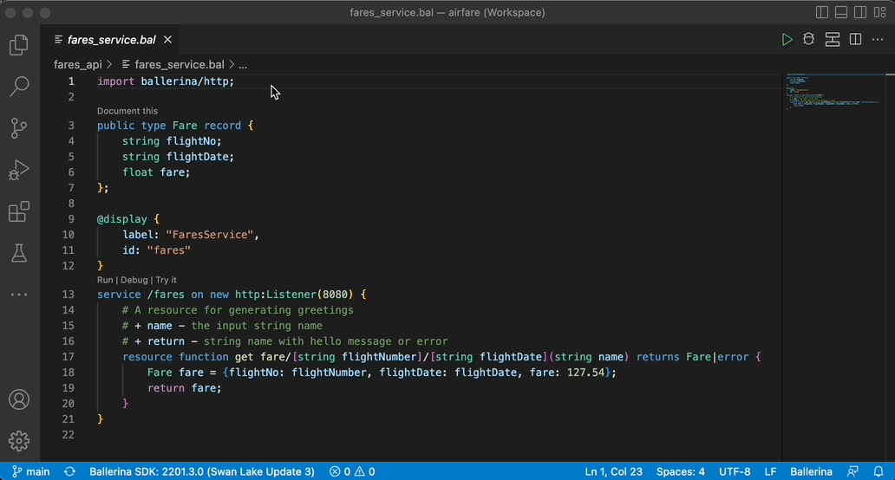

# Ballerina Project Design View

With the increasing size and complexity of software applications, it is likely that your product is a composition of multiple interrelated components. When the number and/or depth of such components grow, the need to generate a simplified overview of their interactions arises. The Ballerina project design view is deployed with the intention of providing a convenient way to generate a high-level picture of such applications, purely based on the source code. In addition to the component interactions, the project design view is also capable of visualizing the Ballerina record types in your application and their associations.

## Set up the prerequisites

Install the latest versions of [Ballerina](https://ballerina.io/downloads/) and [Ballerina Visual Studio Code plugin](https://marketplace.visualstudio.com/items?itemName=wso2.ballerina).

The Ballerina Project Design View tool is packed with the latest release of the Ballerina VS Code plugin available in the VS Code marketplace. The diagrams can be generated upon executing the `Ballerina: Project Design` extension command. However, to get the best possible view of your project, it is necessary to setup your Ballerina project with the following concepts in mind.

## Related Concepts

### A Ballerina project

In the context of this tool, a Ballerina project is considered to be a collection of one or more Ballerina packages.

### A project workspace

In the context of this tool, a Ballerina project is contained by a [VS Code workspace](https://code.visualstudio.com/docs/editor/workspaces). Hence, the diagram generator is functional only if the Ballerina packages are added to the IDE as a workspace.
> **Tip:** You can save your VS Code workspace as a file and simply use this file to access your workspace thereafter. The diagrams could be refreshed to reflect any changes you make to this workspace.

### Service Identifiers

Since multiple services can have the same path, this tool depends on an additional annotation to uniquely identify the services within your project. The current approach to do so is via the `display` annotation, which is a general-purpose annotation that can be used in Ballerina code.

By providing a unique value to the `id` field of the display annotation, you can assign an identifier to each service. For reference, the `CurrencyService` in the following code snippet has been annotated with an ID of the value `currency`, and this identifier will be used to differentiate the service throughout the project.

```ballerina
@display {
   label: "CurrencyService",
   id: "currency"
}
@grpc:ServiceDescriptor {descriptor: ROOT_DESCRIPTOR, descMap: getDescriptorMapDemo()}
service "CurrencyService" on ep {final map<decimal> & readonly currencyMap;
   function init() returns error? {
       json currencyJson = check io:fileReadJson(currencyJsonPath);
       self.currencyMap = check parseCurrencyJson(currencyJson).cloneReadOnly();
   }
 
   remote function GetSupportedCurrencies(Empty value) returns GetSupportedCurrenciesResponse|error {
       return {currency_codes: self.currencyMap.keys()};
   }
}
```

If other services interact with this service, this same identifier has to be provided upon creating the client endpoint. By doing so, it makes it possible to uniquely identify and link the service interactions between one another. 

For example, the code snippet below calls on the `Currency Service` from a different component.

```ballerina
isolated function getSupportedCurrencies() returns string[]|error {
   @display {
       label: "CurrencyService",
   	id: "currency"
   }
   final CurrencyServiceClient currencyClient = check new ("http://localhost:9093");
   GetSupportedCurrenciesResponse|grpc:Error supportedCurrencies = currencyClient->GetSupportedCurrencies({});
   if supportedCurrencies is grpc:Error {
       log:printError("failed to call getSupportedCurrencies from currency service");
       return supportedCurrencies;
   }
   return supportedCurrencies.currency_codes;
}
```

### Invoking service resources

The resource invocations between services need to be done using [client access actions](https://ballerina.io/downloads/swan-lake-release-notes/swan-lake-2201.2.0#support-for-resource-methods-in-client-objects).

## Explore the `Project Design View` features

The Ballerina design diagrams can be generated by executing the `Ballerina: Project Design` command. This command can be found in the VS Code command palette as shown below.


The execution of this command will lead you to a separate webview panel that will contain three types of design diagrams.

### Service Diagram - Level 1

The level 1 diagram is your starting point with the design diagram tool. This diagram displays all the services available within your project with directed links representing any interactions between them. The following is a level 1 diagram generated for a sample Ballerina project.

   
   >**Info:** This project has 4 HTTP services that interact with one another. The directed link between the `Flights` service and the `Bookings` service is an indication that a component in the `Flights` service invokes the `Booking` service. In addition to this, the `Flights` service also invokes an `external` service via a connector.

### Service Diagram - Level 2

The level 2 diagram dives deeper into the compositions of the services and the interactions between them. The following diagram is the level 2 representation of the [same project sample above](#service-diagram---level-1). This diagram depicts the individual resource/remote functions of the services and their invocations.

   

The data types of the request and response bodies of the interactions can be viewed when hovering over a particular invocation.
   

### Types Diagram

The types diagram provides a comprehensive view of all the Ballerina record types defined in your project and their associations.

   

   >**Info:** The multiplicities of the associations are represented on either side of the connector while the [type inclusions](https://ballerina.io/learn/by-example/type-inclusion-for-records/) are differentiated using a directed link (represents inheritance).

In addition to the above diagrams, you can also view the **composition** of an individual record type. These composition diagrams can be accessed by:
   1. Clicking on the record types that are included in the request/response bodies of service invocations shown in the level 2 service diagram
   2. Clicking on the head of the records displayed in the types diagram

The following is the composition diagram generated for the `PassengerFare` record type seen in the [types diagram](#types-diagram) above.
   
   


### Accessory features

In addition to the above, the Ballerina project design diagram tool also includes the following features.
   1. Filter the services and types based on the packages
   2. Rearrange the diagram as appropriate
   3. Export the diagrams in JPEG format
