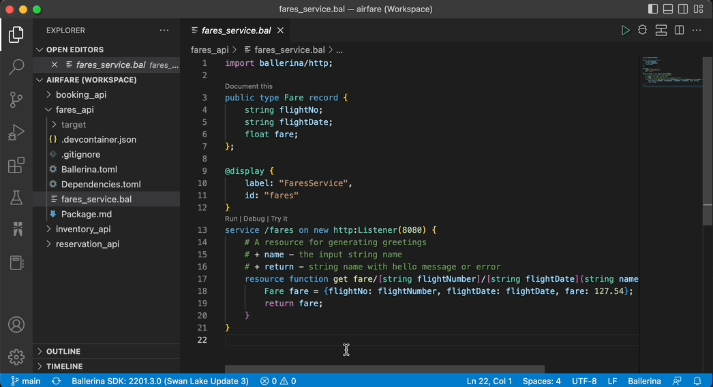

# Ballerina Project Design View

With the increasing size and complexity of software applications, it is likely that your product is a composition of multiple inter-related components. When the number and/or depth of such components grow, the need to create a simple picture of its interactions becomes important. The Ballerina project design view is deployed with this intention of providing a convenient way to generate the high-level picture of such applications, purely based on the source code. And, in addition to the component interactions, the project design view is also capable of visualizing the Ballerina record types in your application and their associations.

## Prerequisites
1. Ballerina version [2201.2.2](https://ballerina.io/downloads/) or upwards
2. Ballerina VSCode plugin version [3.3.0](https://marketplace.visualstudio.com/items?itemName=WSO2.ballerina) or upwards

The Ballerina Project Design View tool is packed with the latest release of the Ballerina VS Code plugin available in the VS Code marketplace. The diagrams can be generated upon executing the `Ballerina: Project Design View` extension command. However, to get the best possible view of your project, it is necessary to setup your Ballerina project with the following concepts in mind.

## Related Concepts

### 1. A Ballerina Project

In the context of this tool, a Ballerina project is considered to be a collection of one or more Ballerina packages.

### 2. The Project Workspace

In the context of this tool, a Ballerina project is contained by a [VSCode workspace](https://code.visualstudio.com/docs/editor/workspaces). Hence, the diagram generator is functional only if the Ballerina packages are added to the IDE as a workspace.
> **Tip:** You can save your VSCode workspace as a file and simply use this file to access your workspace thereafter. The diagrams could be refreshed to reflect any changes you make to this workspace.

### 3. Service Identifiers

Since multiple services can have the same path, this tool depends on an additional annotation to uniquely identify the services within your project. The current approach to do so is via the `display annotation`: a general purpose annotation that can be used in Ballerina code.

By providing an unique value to the id field of the display annotation, you can assign an identifier to each service. For reference, the *CurrencyService* in the following code snippet has been annotated with an id of value *“currency”*, and this identifier will be used to differentiate the service throughout the project.

```ballerina
@display {
   label: "CurrencyService",
   id: "currency"
}
@grpc:ServiceDescriptor {descriptor: ROOT_DESCRIPTOR, descMap: getDescriptorMapDemo()}
service "CurrencyService" on ep {final map<decimal> & readonly currencyMap;
   function init() returns error? {
       json currencyJson = check io:fileReadJson(currencyJsonPath);
       self.currencyMap = check parseCurrencyJson(currencyJson).cloneReadOnly();
   }
 
   remote function GetSupportedCurrencies(Empty value) returns GetSupportedCurrenciesResponse|error {
       return {currency_codes: self.currencyMap.keys()};
   }
}
```

If other services interact with this service, this same identifier has to be provided upon creating the client endpoint. By doing so, it makes it possible to uniquely identify and link the service interactions between one another. 

For example, refer to the following code snippet that calls on the *Currency Service* from a different component.

```ballerina
isolated function getSupportedCurrencies() returns string[]|error {
   @display {
       label: "CurrencyService",
   	id: "currency"
   }
   final CurrencyServiceClient currencyClient = check new ("http://localhost:9093");
   GetSupportedCurrenciesResponse|grpc:Error supportedCurrencies = currencyClient->GetSupportedCurrencies({});
   if supportedCurrencies is grpc:Error {
       log:printError("failed to call getSupportedCurrencies from currency service");
       return supportedCurrencies;
   }
   return supportedCurrencies.currency_codes;
}
```

### 4. Invoking service resources

The resource invocations between services need to be done using [client access actions](https://ballerina.io/downloads/swan-lake-release-notes/swan-lake-2201.2.0#support-for-resource-methods-in-client-objects).

## Explore the Project Design View Features
As mentioned previously, the design diagrams view for Ballerina projects can be generated through the extension command.

  
