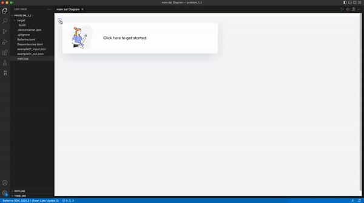
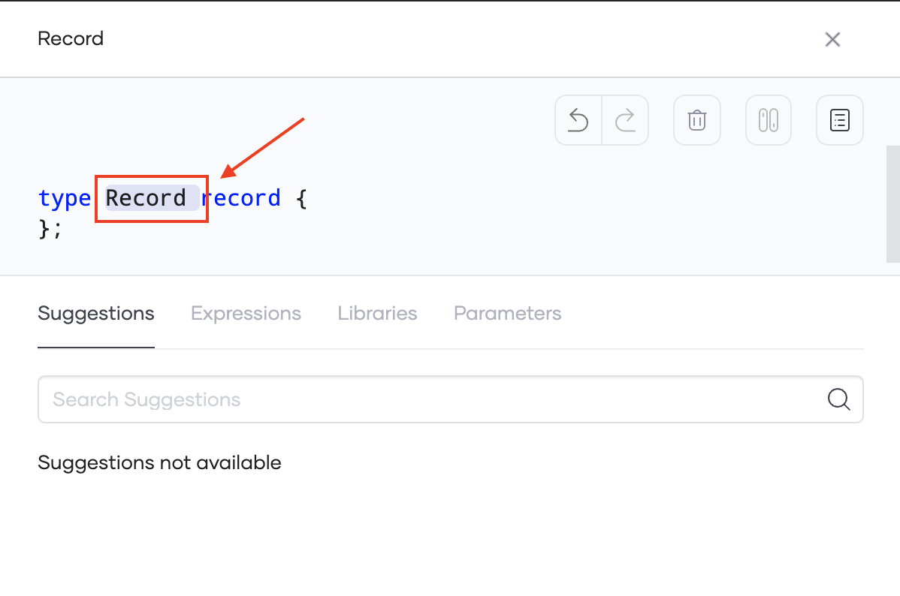
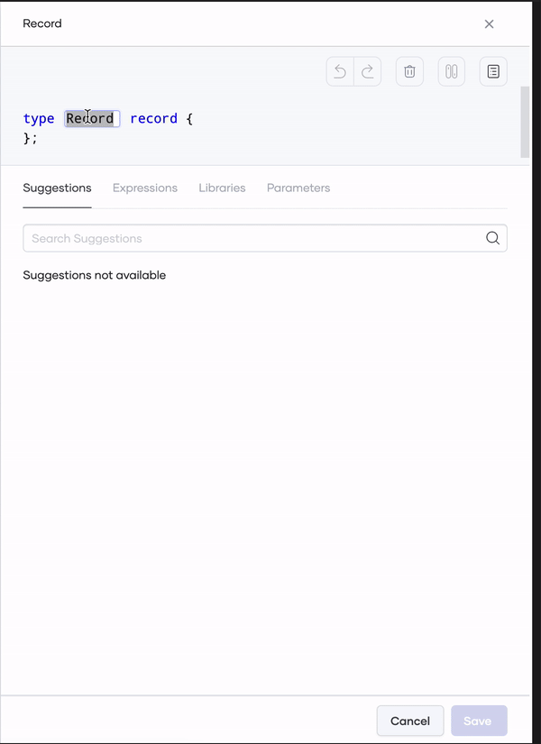
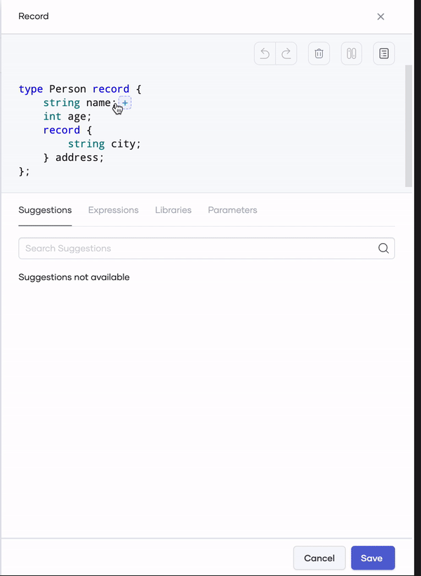
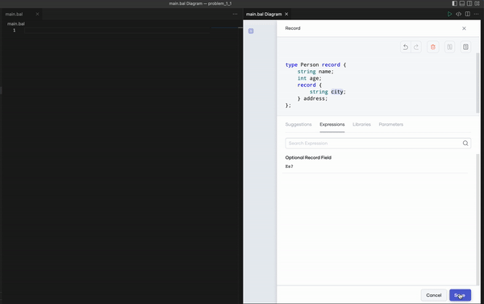
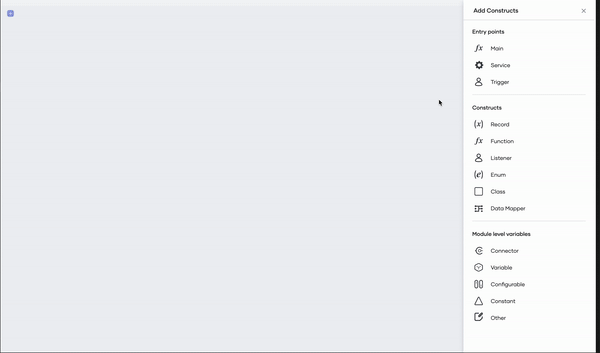
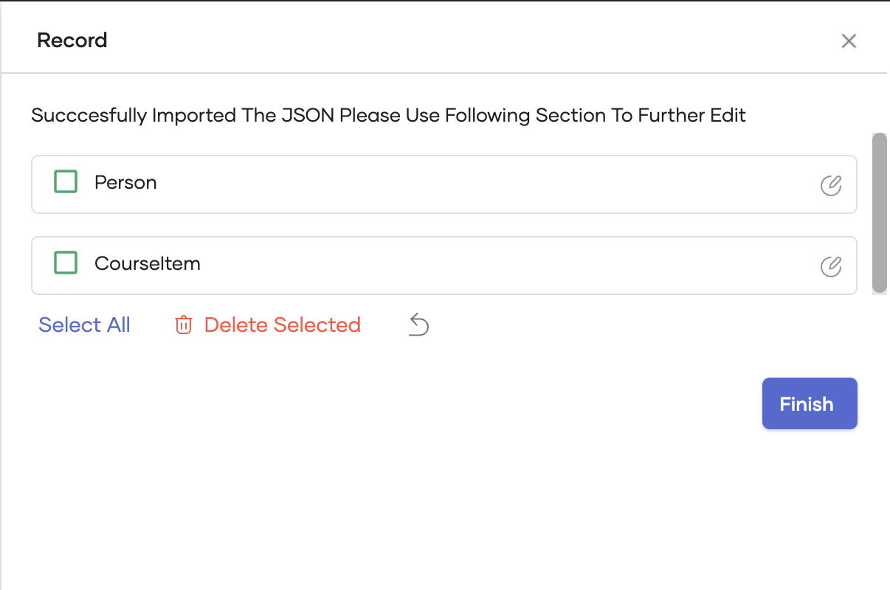

# Editing records graphically with Ballerina

Record is the type system introduced by the ballerina language to hold data by a user. Users can use records when they want to define their data schemas. Once the records are created users can easily manipulate data inside a user programme.

Ballerina is a multi-paradigm language. You can define records in an imperative manner with Ballerina. On top of that, the Ballerina VS Code plugin comes with record editing capabilities, which will help users to edit records graphically.

In the record editor, users have the ability to create a record from scratch or create a record by importing a JSON.

## Set up the prerequisites

1. Install the latest versions of [Ballerina](https://ballerina.io/downloads/) and [Ballerina Visual Studio Code plugin](https://marketplace.visualstudio.com/items?itemName=wso2.ballerina).

2. Execute the command below to create a package (if you are not already working on one).

    ```bash
    bal new convert
    ```

3. Open the created package in VS Code.

### Create a record from scratch

1. Navigate to the record editor please select Create New option.



2. In order to provide a record name, Please double-click on the default record name.
Change record name image



3. Use the plus button at the end to add new fields to the record.
>**Info:** Use the expressions tab in the record editor to create nested records by selecting the particular record expression.



4. In order to add default values please select the semicolon(;) of a field and select the default value expression.



5. Once the record field configuration is done, please click save.



### Create a record by importing a JSON

#### Prerequisites
* Create a file with the data below in JSON format.

    >**Info:** The example below converts a `person` and a list of `courses` to a `student` record. 

    ```json
    {
        "person": {
            "id": 1001,
            "firstName": "Vinnie",
            "lastName": "Hickman",
            "age": 15
        },
        "course": [
            {
                "id": "CS6002",
                "name": "Computation Structures",
                "credits": 4
            },
            {
                "id": "CS6003",
                "name": "Circuits and Electronics",
                "credits": 3
            },
            {
                "id": "CS6004",
                "name": "Signals and Systems",
                "credits": 3
            }
        ]
    }
    ```

In ballerina language, it provides an option for users to bring their JSONs and easily convert those JSONs into record definitions. Please use the following steps to create a record from a JSON.

1. Once you navigate to the record editor please select **Import A JSON** option.

2. Then provide a name for the record.

3. Then provide the sample JSON by either typing on the text area or by choosing the file created from the file selector.

4. In order to make separate ballerina record definitions please check **Make Separate Record Definitions**.



5. Then use the preview of the created record to further edit the created records and click save once editing is complete.


